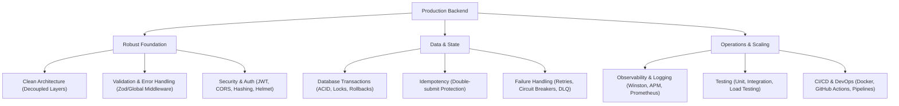

# 🚀 Production-Grade Backend Master Plan
## Become a Founding SDE / Senior Backend Engineer in 4 Weeks

This roadmap transitions you from simple API scripting to building **resilient, secure, scalable, and observable backend systems**. It prioritizes production realities: validation, clean architecture, tests, structured logging, database transactions, idempotency, failure handling, and CI/CD.

---

## 🏗️ The 11 Core Pillars of Production Backends

Before diving into the weekly schedule, you must master these production-level concepts:



### 1. Clean Architecture
*   **The Problem:** Putting all logic in controllers makes code untestable and tightly coupled to the framework/database.
*   **The Solution:** Decouple your system into concentric circles:
    *   **Domain/Entities:** Pure business rules (no database or framework dependencies).
    *   **Use Cases/Services:** Orchestrates data flow to and from entities.
    *   **Adapters/Repositories:** Bridges the database, external APIs, and controllers.
    *   **Infrastructure:** Database drivers, web frameworks (Express/Gin), and servers.

### 2. Validation & Type-Safety
*   **The Problem:** Accepting raw payloads directly into databases leads to injection attacks, corrupted data, and runtime crashes.
*   **The Solution:** Strictly validate all incoming data (`req.params`, `req.query`, `req.body`) at the entry boundary using schemas (e.g., Zod, Joi) before it hits business logic.

### 3. Global Error Handling
*   **The Problem:** `try-catch` blocks scattered everywhere returning inconsistent status codes and leaking internal system traces to clients.
*   **The Solution:** Create a centralized global error-handling middleware. Map system-level errors to custom class exceptions (e.g., `AppError`, `NotFoundError`, `ConflictError`) with standard RFC-7807 JSON error responses.

### 4. Security
*   **The Problem:** Plain-text passwords, open CORS, lack of rate limits, and exposure to SQL injection or XSS.
*   **The Solution:** Implement JWT with short-lived access tokens and secure, HTTP-only cookie refresh tokens; hash passwords with Argon2/bcrypt; secure headers using Helmet; and validate inputs to prevent injections.

### 5. Database Transactions
*   **The Problem:** Upgrading a user's subscription successfully but failing to create the invoice, leaving the DB in an inconsistent state.
*   **The Solution:** Wrap multi-step writes in ACID transactions. Ensure database rollbacks occur immediately if any step fails. Master concurrency control using Optimistic and Pessimistic Locking.

### 6. Idempotency
*   **The Problem:** A user clicks "Pay Now" twice due to lag, charging them double.
*   **The Solution:** Require an `Idempotency-Key` header for mutation requests. Store request statuses and response payloads in Redis to instantly replay the cached response on duplicate attempts.

### 7. Structured Logging & Observability
*   **The Problem:** Standard `console.log` statements are synchronous (blocking execution) and unsearchable in production.
*   **The Solution:** Implement structured logging (JSON format) using Winston or Pino. Log levels must be explicit (`debug`, `info`, `warn`, `error`). Include correlation IDs (`X-Correlation-ID`) across asynchronous operations for easy log-tracing.

### 8. Failure Handling & Resiliency
*   **The Problem:** An external API drops temporarily, causing your entire application sequence to crash or hang.
*   **The Solution:** Apply resiliency patterns:
    *   **Exponential Backoff Retries:** Retry failed network calls with increasing intervals and random jitter.
    *   **Circuit Breakers:** Cut off requests to failing downstream services to prevent resource exhaustion.
    *   **Dead Letter Queues (DLQ):** Route persistently failing messages out of queues for offline inspection.

### 9. Testing
*   **The Problem:** Deploying code with "it works on my machine" assumptions, only to break core business flows in production.
*   **The Solution:** Write unit tests for domain logic (using Jest/Vitest), integration tests for database repositories, and end-to-end API tests using Supertest. Target at least 80% coverage on core business pathways.

### 10. Observability (APM & Metrics)
*   **The Problem:** The server is running slow, but you have no visibility into database query execution times or memory leaks.
*   **The Solution:** Set up Application Performance Monitoring (APM) tools or metrics exporters (Prometheus + Grafana) to track RED metrics (Rate, Errors, Duration) and system resources.

### 11. CI/CD & Automation
*   **The Problem:** Manual deployments lead to configuration drift, missed migrations, and human errors.
*   **The Solution:** Configure automated workflows (e.g., GitHub Actions) to run linter checks, type checks, and tests on every pull request, and automatically deploy successful builds.

---

## 📅 The 4-Week Action Plan

```
┌─────────────────────────────────────────────────────────────┐
│                       WEEK 1: FOUNDATION                    │
│   HTTP, REST, Express, Validation, Error Handler, Auth API  │
└──────────────────────────────┬──────────────────────────────┘
                               ▼
┌─────────────────────────────────────────────────────────────┐
│                       WEEK 2: DATABASE                      │
│   Schema Design, Indexes, Transactions, Expense Tracker API │
└──────────────────────────────┬──────────────────────────────┘
                               ▼
┌─────────────────────────────────────────────────────────────┐
│                      WEEK 3: PRODUCTION                     │
│  Redis, Docker, BullMQ, Testing, File Upload, Production App│
└──────────────────────────────┬──────────────────────────────┘
                               ▼
┌─────────────────────────────────────────────────────────────┐
│                       WEEK 4: SCALING                       │
│    Kafka, WebSockets, Load Testing, Metrics, Chat System    │
└─────────────────────────────────────────────────────────────┘
```

---

### 🌐 Week 1 — Foundation & Security Boundary
**Goal:** Build a robust, secure, and type-safe API boundary using clean patterns.

#### 💡 Core Topics
1.  **HTTP Protocols & REST APIs:** Custom status codes, headers, and payload structures.
2.  **Clean Folder Structure:** Organizing code by layer or feature rather than dumping everything in one folder.
3.  **Middleware Pipeline:** Designing an Express/Gin middleware chain (Logger -> CORS -> BodyParser -> RateLimiter -> Router -> Error Handler).
4.  **Schema Validation:** Validating inputs at the entry boundary using Zod/Joi.
5.  **Global Error Handling:** Replacing `try-catch` spam with custom Error classes and a centralized middleware parser.
6.  **Authentication & Security:** JWT architecture, Access vs. Refresh tokens, secure HTTP-only cookies, password hashing (Argon2/bcrypt), and Helmet security headers.

#### 🛠️ Core Project: Production-Grade Auth API
Build a secure authentication server that supports sign-up, sign-in, JWT refresh rotations, session revocation, and route protection.

*   **Implementation Checklist:**
    *   [ ] Initialize TypeScript project with strict mode enabled.
    *   [ ] Implement a Clean Architecture directory layout:
        ```text
        src/
        ├── app.ts                 # App initialization & middleware binding
        ├── server.ts              # HTTP listener
        ├── config/                # Environment variable parsing (Zod verified)
        ├── domain/                # Pure business logic, Interfaces
        ├── controllers/           # HTTP transport layer mapping
        ├── services/              # Orchestrators (Auth, Token rotation)
        ├── repositories/          # Database persistence adapters
        ├── middlewares/           # Auth, Validation, Global Error Handler
        └── utils/                 # Logger wrappers, cryptography helpers
        ```
    *   [ ] Build a **Zod Validation Middleware** to intercept incoming requests before reaching route handlers.
    *   [ ] Write a **Global Error Handler** that catches asynchronous errors, logs them with details, and returns uniform JSON responses.
    *   [ ] Implement **JWT authentication** using access tokens (15m expiry) and rotation-enabled refresh tokens stored in secure, `httpOnly`, `sameSite: strict` cookies.
    *   [ ] Secure API endpoints using Express-Rate-Limit and Helmet headers.

---

### 💾 Week 2 — Database Design, Relations & Transactions
**Goal:** Master database modeling, transaction management, and indexing strategies.

#### 💡 Core Topics
1.  **Relational vs. Non-Relational (PostgreSQL vs. MongoDB):** Document models vs. normalized schemas, choosing the right tool for the job.
2.  **Schema Design & Normalization:** 1NF, 2NF, 3NF, designing one-to-many and many-to-many relationships.
3.  **Indexing Strategies:** Understanding Clustered/Primary vs. Non-Clustered indexes. Creating composite and partial indexes for query optimization.
4.  **Database Transactions (ACID):** Maintaining state consistency. Managing Isolation Levels (Read Committed, Serializable) and preventing race conditions using **Optimistic Locking** (version fields) and **Pessimistic Locking** (`SELECT FOR UPDATE`).
5.  **Raw SQL vs. ORMs:** Writing raw SQL queries, schema structures, transactions, and locking statements directly before using any ORM. Understanding query compilation and optimization.
6.  **Repository Pattern:** Decoupling business logic from database-specific syntax (Prisma, Mongoose, raw SQL).

#### 🛠️ Core Project: Financial Expense Tracker API
Build a multi-tenant expense management system supporting split transactions, wallets, category categorization, and ledger reports.

*   **Implementation Checklist:**
    *   [ ] Spin up a local PostgreSQL database using Docker.
    *   [ ] Design the database schema using an ORM (e.g., Prisma) or SQL migrations:
        *   `Users` (1:M with `Wallets`, 1:M with `Expenses`)
        *   `Wallets` (id, balance, currency, version - for Optimistic locking)
        *   `Expenses` (id, amount, description, timestamp, walletId)
        *   `TransactionLedger` (debit/credit records for auditing)
    *   [ ] Add database indexes on frequently queried fields (e.g., `walletId`, `timestamp`, `category`).
    *   [ ] Write a **split-expense feature** wrapped inside a database transaction:
        *   *Example:* If User A pays User B from Wallet 1 to Wallet 2, decrement Wallet 1, increment Wallet 2, and write audit ledger logs. Ensure a failure in any step rolls back the entire operations block.
    *   [ ] Implement the **Repository Pattern** to ensure the database can be swapped (e.g., PostgreSQL to MongoDB) without modifying service layer business logic.

---

### ⚙️ Week 3 — Production Infrastructure & Operations
**Goal:** Build a production-ready application featuring background job handling, caching, containerization, and automated testing.

#### 💡 Core Topics
1.  **Redis Basics:** Utilizing memory stores for distributed caching, sessions, and simple key-value lookups.
2.  **Containerization (Docker):** Creating multi-stage Docker builds to containerize backends and compile production binaries.
3.  **Structured Logging:** Setting up Winston or Pino with JSON formatting to output logs containing process IDs and correlation IDs.
4.  **Rate Limiting:** Guarding public routes with token-bucket algorithm limiters backed by Redis.
5.  **In-Memory Asynchronous Queues:** Understanding Node.js Events, Event Emitters, and processing background tasks in memory (and why this fails when the process crashes).
6.  **Background Jobs (BullMQ):** Offloading CPU-intensive or slow operations (e.g., PDF generation, emails) to robust background workers using Redis-backed persistent message queues.
6.  **Testing Suite:** Writing unit tests for business logic, mocking external dependencies, and creating integration tests using actual test databases.

#### 🛠️ Core Project: Production-Ready Notification & Processing Engine
Create a backend system that handles large file uploads, processes csv records, schedules background email deliveries, and rate-limits API usage.

*   **Implementation Checklist:**
    *   [ ] Dockerize the application: Write a multi-stage `Dockerfile` and setup a `docker-compose.yml` defining services for the API, PostgreSQL, Redis, and BullMQ Workers.
    *   [ ] Integrate **Winston** to log to stdout (and write to local log files in JSON format). Attach a middleware that generates a unique UUID (Correlation ID) for every request and injects it into all child logs.
    *   [ ] Implement **BullMQ** for async workers:
        *   When a user uploads a CSV file, store it and enqueue a job.
        *   Workers process the CSV file chunk by chunk, calculate data, and enqueue email alerts.
    *   [ ] Write a test suite with **Jest/Vitest** and **Supertest**:
        *   Mock the email services and BullMQ queues to isolate unit testing.
        *   Run database tests against an ephemeral PostgreSQL Docker container.

---

### 📈 Week 4 — Scaling, Real-time & Observability
**Goal:** Design highly concurrent systems using message brokers, WebSockets, performance tuning, and monitoring suites.

#### 💡 Core Topics
1.  **Message Brokers (Kafka/RabbitMQ):** Understanding event-driven messaging pipelines, producer/consumer models, and partitioning strategies.
2.  **Real-time Communication (WebSockets):** Implementing persistent duplex communication, connection handshakes, and pub/sub mechanisms.
3.  **Performance Optimization:** Applying database connection pooling, query pagination, and multi-level caching strategies.
4.  **Load Testing:** Simulating high-traffic scenarios using tools like k6 or Autocannon.
5.  **Observability & APM:** Setting up Prometheus metrics collection, Grafana dashboards, or datadog traces.

#### 🛠️ Core Project: Real-time Auction & Leaderboard System
Build an auction system where bids are processed concurrently, distributed via message queues, broadcasted in real-time, and loaded onto a live scoreboard.

*   **Implementation Checklist:**
    *   [ ] Set up a WebSocket server (using `ws` or Socket.io) along with Redis Pub/Sub to allow horizontal scaling of WebSocket nodes.
    *   [ ] Use **Kafka** or **BullMQ** to process bids asynchronously. Ensure high-speed bid validations occur prior to event publishing.
    *   [ ] Use **Redis Sorted Sets (ZADD/ZREVRANGE)** to store and update the live auction leaderboard.
    *   [ ] Write a **k6 script** to load test the auction API with 1000 virtual users (VUs) sending concurrent bids. Analyze CPU, memory bottlenecks, and database locks.
    *   [ ] Export system metrics to **Prometheus** (request count, latencies, active WebSocket connections) and build a **Grafana Dashboard** for real-time visualization.

---

## 💻 Standard Production Patterns & Reference Implementations

Here are reference code patterns that demonstrate these concepts in action.

### 🧩 1. Clean Controller / Service / Repository Layering

```typescript
// 1. Controller Layer: Validate HTTP Input & Map Output
import { Request, Response, NextFunction } from 'express';
import { UserService } from '../services/user.service';
import { signUpSchema } from '../validators/auth.validator';

export class UserController {
  constructor(private userService: UserService) {}

  async register(req: Request, res: Response, next: NextFunction) {
    try {
      // Input Validation
      const validatedData = signUpSchema.parse(req.body);
      
      // Business Logic Execution
      const newUser = await this.userService.createUser(validatedData);
      
      // REST Response
      return res.status(201).json({ success: true, data: newUser });
    } catch (error) {
      next(error); // Forward to Global Error Handler
    }
  }
}
```

---

### 🛡️ 2. Global Error Handling Middleware

```typescript
// app-error.ts (Domain Layer Custom Exception)
export class AppError extends Error {
  constructor(
    public message: string,
    public statusCode: number,
    public isOperational = true
  ) {
    super(message);
    Object.setPrototypeOf(this, new.target.prototype);
    Error.captureStackTrace(this, this.constructor);
  }
}

// error.middleware.ts (Infrastructure Layer)
import { Request, Response, NextFunction } from 'express';
import { AppError } from '../errors/app-error';

export const globalErrorHandler = (
  error: Error,
  req: Request,
  res: Response,
  next: NextFunction
) => {
  const correlationId = req.headers['x-correlation-id'] || 'system';
  
  if (error instanceof AppError) {
    return res.status(error.statusCode).json({
      success: false,
      error: {
        message: error.message,
        statusCode: error.statusCode,
        correlationId
      }
    });
  }

  // Fallback for unexpected system errors (prevent leakage)
  console.error(`[ERROR] CorrelationId: ${correlationId} | Stack:`, error);
  
  return res.status(500).json({
    success: false,
    error: {
      message: 'Internal Server Error',
      statusCode: 500,
      correlationId
    }
  });
};
```

---

### 💳 3. Database Transaction with Rollback & Locking

```typescript
// expense.repository.ts
import { PrismaClient } from '@prisma/client';
import { AppError } from '../errors/app-error';

const prisma = new PrismaClient();

export async function transferFunds(
  fromWalletId: string,
  toWalletId: string,
  amount: number
) {
  // Execute transactional query sequence
  return await prisma.$transaction(async (tx) => {
    // 1. Fetch Wallets with Pessimistic Locking (Select for Update)
    const [fromWallet] = await tx.$queryRaw<any[]>`
      SELECT * FROM "Wallet" WHERE id = ${fromWalletId} FOR UPDATE
    `;
    
    if (!fromWallet || fromWallet.balance < amount) {
      throw new AppError('Insufficient wallet balance', 400);
    }

    // 2. Perform Account Deductions and Increments
    await tx.wallet.update({
      where: { id: fromWalletId },
      data: { balance: { decrement: amount } },
    });

    await tx.wallet.update({
      where: { id: toWalletId },
      data: { balance: { increment: amount } },
    });

    // 3. Log Audit ledger record
    const ledgerRecord = await tx.ledger.create({
      data: {
        fromWalletId,
        toWalletId,
        amount,
        status: 'COMPLETED',
      },
    });

    return ledgerRecord;
  }); // Errors thrown inside automatically trigger transactional rollback
}
```

---

### 🔁 4. Redis Idempotency Middleware

```typescript
import { Request, Response, NextFunction } from 'express';
import Redis from 'ioredis';

const redis = new Redis();

export const idempotencyGuard = async (
  req: Request,
  res: Response,
  next: NextFunction
) => {
  const idempotencyKey = req.headers['x-idempotency-key'];
  if (!idempotencyKey || typeof idempotencyKey !== 'string') {
    return next(); // Skip if no key provided (or enforce it for write operations)
  }

  const cacheKey = `idempotency:${idempotencyKey}`;
  const existingRecord = await redis.get(cacheKey);

  if (existingRecord) {
    const { status, body } = JSON.parse(existingRecord);
    return res.status(status).json(body); // Return identical cached response
  }

  // Intercept res.json to cache the response before final transmission
  const originalJson = res.json;
  res.json = function (body) {
    redis.set(cacheKey, JSON.stringify({ status: res.statusCode, body }), 'EX', 86400); // Cache for 24h
    return originalJson.call(this, body);
  };

  next();
};
```

---

## 🛠️ Success & Evaluation Checklist

By the end of this 4-week roadmap, you should be able to answer **YES** to all the following:

- [ ] **Architecture:** Can you explain the difference between a Controller, a Service, and a Repository? Can you swap databases without changing your API endpoints?
- [ ] **Validation:** Do all API routes reject malformed payloads *before* database operations occur?
- [ ] **Error Handling:** Are there any unhandled promise rejections or raw stack traces returned to the API client on failure?
- [ ] **Concurrency:** Can your schema prevent double-booking issues under concurrent API stress? Do you understand the difference between Optimistic and Pessimistic locks?
- [ ] **Observability:** Can you track an API request from the gateway through background workers using a single Correlation ID?
- [ ] **Docker:** Can you run your entire backend system (DB, Redis, API, and Workers) with a single `docker-compose up` command?
- [ ] **Testing:** Do you have unit tests verifying your business logic and integration tests asserting DB behavior under actual migrations?
