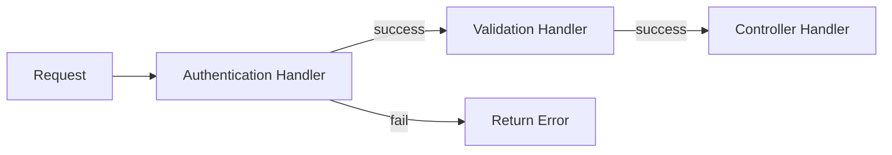

# Chain of Responsibility Design Pattern (Behavioral Pattern)

> **"Avoid coupling the sender of a request to its receiver by giving more than one object a chance to handle the request. Chain the receiving objects and pass the request along the chain until an object handles it."**

---

## Simple Version (Aasan Bhasha Mein)
Chain of Responsibility ka matlab hai **ek request ko multiple handlers ki ek chain (line) se guzarna**. 

Har handler check karta hai ki kya wo is request ko process kar sakta hai ya nahi. Agar haan, toh wo process kar leta hai (ya aage bhej deta hai). Agar nahi, toh wo request ko chain mein agle handler ko pass kar deta hai.

---

## The Analogy: Express.js Middleware 🛡️
Soch teri web app par ek request aati hai `/delete-profile`.
1. **Handler 1 (Logging):** Request detail logs karta hai. Phir calls `next()`.
2. **Handler 2 (Auth check):** Check karta hai user logged in hai ya nahi. Agar logged in hai, calls `next()`. Agar nahi, block request!
3. **Handler 3 (Validation check):** Request parameter check karta hai. If valid, calls `next()`.
4. **Handler 4 (Controller):** Actual task process karke profile delete karta hai.

Ye flow ek chain hai jise hum **Chain of Responsibility** kehte hain.

---

## The Problem: Monolithic If-Else validation ❌
Agar is pattern ko use na kiya jaye, toh ek hi validation block banana padega:
```typescript
function handleRequest(req) {
    if (logRequest(req)) {
        if (authenticate(req)) {
            if (validate(req)) {
                deleteProfile(req);
            }
        }
    }
}
```
**Dikkat:** Code nested ho jata hai (Callback Hell) aur dynamic runtime insertion/removal hard ho jata hai.

---

## Structure: How to implement Chain of Responsibility?

1. **Handler Interface:** `Handler` interface with methods:
   - `setNext(handler: Handler): Handler` (Chain attach karne ke liye)
   - `handle(request: any): any` (Request process karne ke liye)
2. **Abstract Base Handler (Optional but helpful):** Common logic for keeping reference of `next` handler.
3. **Concrete Handlers:** LogHandler, AuthHandler, ValidationHandler.
4. **Client:** Request bhejta hai chain ke pehle handler ko.



---

## File to Implement
File Name: `request_chain.ts`

### Task Description:
Hum ek API Request processing chain banayenge.

1. **Base Handler Interface / Abstract Class (`RequestHandler`):**
   - Property: `private nextHandler: RequestHandler | null = null`
   - Method: `setNext(handler: RequestHandler): RequestHandler` (Sets the next handler and returns it to allow chaining: `h1.setNext(h2).setNext(h3)`)
   - Method: `handle(request: string): string | null` (Processes request, if nextHandler exists, delegates to it)
2. **Concrete Handlers:**
   - **`AuthHandler`**: Checks if request contains token. (If request string includes "token=valid" -> proceed. Else return "Auth Failed")
   - **`ValidationHandler`**: Checks if request has body data. (If request includes "body=present" -> proceed. Else return "Validation Failed")
   - **`LoggerHandler`**: Simply prints logging info and proceeds to next handler.
3. **Client Code:**
   - Chain set karo: `LoggerHandler` -> `AuthHandler` -> `ValidationHandler`
   - Test Case 1: Send valid request `"token=valid,body=present"` (Should pass all chains)
   - Test Case 2: Send invalid auth request `"token=invalid,body=present"` (Should fail at Auth)
   - Test Case 3: Send invalid validation request `"token=valid,body=empty"` (Should fail at Validation)
