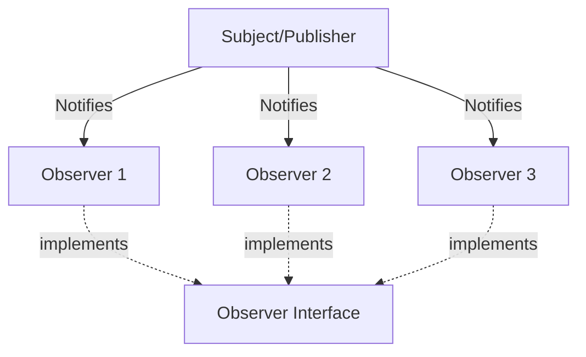

# Observer Design Pattern (Behavioral Pattern)

> **"Define a one-to-many dependency between objects so that when one object changes state, all its dependents are notified and updated automatically."**

---

## Simple Version (Aasan Bhasha Mein)
Observer pattern ka use tab hota hai jab **ek object ke state change hone par, hume baaki sabhi dependent objects ko automatically inform/notify karna ho**. 

Ise **Pub-Sub (Publisher-Subscriber)** model bhi bolte hain. Jo notify karta hai use "Publisher/Subject" bolte hain, aur jo notifications sunte hain use "Subscribers/Observers" bolte hain.

---

## The Analogy: YouTube Channel & Notifications 🔔
*   Tu ek YouTube Channel (Subject) ko **Subscribe** karta hai.
*   Jab bhi channel par naya video upload hota hai (state change), YouTube automatically saare Subscribers (Observers) ko notification bhej deta hai.
*   Agar tu **Unsubscribe** kar deta hai, toh notifications aane band ho jaate hain.

Yahi simple logic code mein use hota hai.

---

## The Problem: Polling vs Push ❌
Agar Observer pattern na ho, toh dependent classes ko lagatar loop chala kar check karna padega (Polling): *"Kya state change hui? Kya naya video aaya?"*. Isse CPU aur resources waste hote hain.
**Solution:** Push mechanism — Publisher khud se notify karega jab zaroorat hogi.

---

## Structure: How to implement Observer in TypeScript?

1. **Observer Interface:** Ek rulebook jo batati hai ki Notification aane par observer kya action lega (e.g., `update(data: any): void`).
2. **Subject Interface:** Rules for subscribing, unsubscribing, and notifying.
3. **Concrete Subject:** Jo actual events publish karega aur subscribers ki list maintain karega (`observers: Observer[]`).
4. **Concrete Observers:** Actual classes jo notifications receive karengi (e.g., EmailUser, SMSUser).

---

## File to Implement
File Name: `youtube_observer.ts`

### Task Description:
Hum ek YouTube Channel notification system banayenge.

1. **Observer Interface (`Observer`):**
   - Method: `update(videoTitle: string): void`
2. **Subject Interface (`Subject`):**
   - Methods: `subscribe(observer: Observer): void`, `unsubscribe(observer: Observer): void`, `notify(videoTitle: string): void`
3. **Concrete Subject (`YoutubeChannel`):**
   - Property: `private subscribers: Observer[] = []`
   - Implement `subscribe`, `unsubscribe`, aur `notify`.
   - Method: `uploadVideo(title: string)` जो internal video upload process kare aur notify method call kare.
4. **Concrete Observers (`User`):**
   - Property: `private name: string`
   - Implement `update(videoTitle: string)` jo print kare: `"[name] received notification: New video uploaded - [videoTitle]"`
5. **Client code test:**
   - Channel create karo.
   - 2 Users (e.g. Om, Aayush) ko subscribe karwao.
   - Video upload karo (Dono ko notification jaana chahiye).
   - Aayush ko unsubscribe karwao.
   - Doosra video upload karo (Sirf Om ko notification jaana chahiye).
