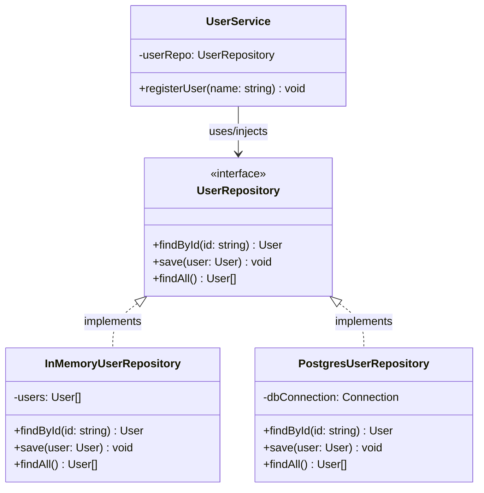

# Repository Design Pattern (Architectural Pattern)

> **"Mediates between the domain and data mapping layers using a collection-like interface for accessing domain objects."**

---

## Simple Version (Aasan Bhasha Mein)
Repository Pattern ka matlab hai **Database logic ko Business logic (Service Layer) se alag karna**.

Soch teri application ko database se user fetch karna hai.
*   **Bina Repository:** Teri Service class directly SQL query chala rahi hai ya MongoDB command likh rahi hai. (Agar kal ko DB change kiya, toh saari Service classes modify karni padegi ❌).
*   **With Repository:** Service class sirf Repository se kehti hai: *"Mujhe ID 5 ka User do."* Repository internally SQL chalaye, MongoDB chalaye, ya simple memory array se laaye, Service class ko isse koi matlab nahi hai.

---

## The Analogy: Zomato Order 🍔
Jab tu Zomato par order karta hai:
1. **Tu (Service Layer):** Order place karta hai ("Paneer Butter Masala deliver karo").
2. **Delivery Boy (Repository):** Restaurant jata hai, food collect karta hai aur tujhe de deta hai.
3. **Restaurant (Database):** Jahan khana banta hai.

Tujhe (Service ko) isse koi matlab nahi hai ki kitchen ke andar paneer kaise bana, kis brand ka tel use hua. Tujhe bas tera food (Data) mil gaya.

---

## Why use Repository Pattern?
1. **Database Decoupling:** Tu database ko bina business logic chhede change kar sakta hai (e.g., SQLite to PostgreSQL, or PostgreSQL to MongoDB).
2. **Easy Testing:** Hum integration testing ke liye mock repositories (In-Memory array) aaram se use kar sakte hain bina real DB setup kiye.
3. **Single Responsibility Principle (SRP):** Database queries likhne ka kaam sirf Repository ka hai, Service class sirf business logic chalayegi.

---

## Class Diagram

---

## File to Implement
File Name: `user_repository.ts`

### Task Description:
Hum ek dummy User Registration system banayenge jo Repository pattern follow karega.

1. **User Interface:**
   - `{ id: string, name: string, email: string }`
2. **UserRepository Interface:**
   - `save(user: User): void`
   - `findById(id: string): User | null`
   - `findAll(): User[]`
3. **InMemoryUserRepository (Concrete Implementation 1):**
   - Holds an in-memory array `private users: User[] = []`.
   - Implements all `UserRepository` methods.
4. **UserService (Business Logic Layer):**
   - Inject `UserRepository` in constructor (Dependency Injection).
   - Method `register(name: string, email: string)`:
     *   Check if email already exists (using `findAll()`). If yes, throw error.
     *   Create new user with random ID and save it using `repo.save()`.
5. **Client Code:**
   - Create instance of `InMemoryUserRepository`.
   - Pass it to `UserService`.
   - Register a few users and print the repository state to verify.
