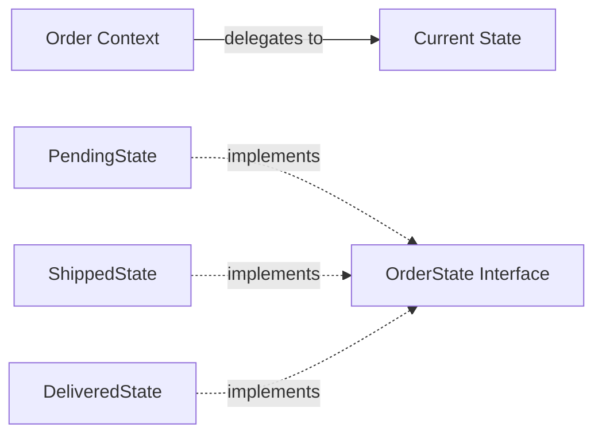

# State Design Pattern (Behavioral Pattern)

> **"Allow an object to alter its behaviour when its internal state changes. The object will appear to change its class."**

---

## Simple Version (Aasan Bhasha Mein)
State pattern ka use tab hota hai jab **ek object ka behaviour uski current state ke basis par change hota hai.** Har state ke liye alag class banao, aur object apni state switch karta rahe — bina giant if-else/switch blocks ke.

---

## The Analogy: Traffic Light 🚦
Soch ek traffic signal:
*   **Red State:** Cars ruki hain. Next state → Green.
*   **Green State:** Cars chal rahi hain. Next state → Yellow.
*   **Yellow State:** Cars slow ho rahi hain. Next state → Red.

Har state ka apna behaviour hai, aur har state jaanti hai ki agle state mein kaise transition karna hai.

---

## The Problem: Giant If-Else (OCP Violation) ❌
```typescript
class Order {
    status: string = "pending";

    process() {
        if (this.status === "pending") {
            console.log("Processing order...");
            this.status = "shipped";
        } else if (this.status === "shipped") {
            console.log("Order already shipped!");
        } else if (this.status === "delivered") {
            console.log("Order already delivered!");
        }
        // Kal ko 5 aur states aaye toh? 10 else-if? 💀
    }
}
```

---

## The Solution: State Pattern ✅
Har state ko ek alag class bana do. Object (`Order`) apni current state ko hold karta hai aur har action us state class ko delegate karta hai.



---

## File to Implement
File Name: `order_state.ts`

### Task Description:
Hum ek Order Status Machine banayenge.

1. **State Interface (`OrderState`):**
   - Method: `next(order: Order): void` (Order ko next state mein le jaaye)
   - Method: `status(): string` (Current state ka naam return kare)
2. **Concrete States:**
   - **`PendingState`**: `next()` → Order ko `ShippedState` mein move kare. `status()` → returns "PENDING".
   - **`ShippedState`**: `next()` → Order ko `DeliveredState` mein move kare. `status()` → returns "SHIPPED".
   - **`DeliveredState`**: `next()` → Log kare "Order already delivered, no next state." `status()` → returns "DELIVERED".
3. **Context Class (`Order`):**
   - Property: `private currentState: OrderState` (starts with `PendingState`).
   - Method: `setState(state: OrderState)` — state switch karta hai.
   - Method: `getStatus(): string` — delegates to `currentState.status()`.
   - Method: `nextStep(): void` — delegates to `currentState.next(this)`.
4. **Client Code:**
   - Order banao.
   - `nextStep()` call karo 3 baar — PENDING → SHIPPED → DELIVERED → "Already delivered".
