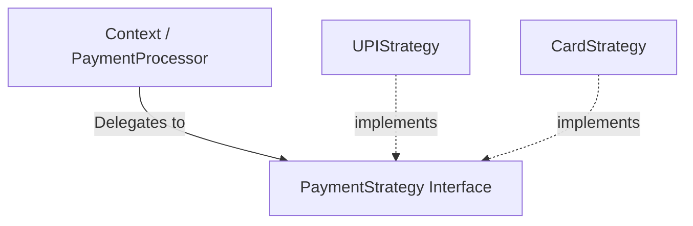

# Strategy Design Pattern (Behavioral Pattern)

> **"Define a family of algorithms, encapsulate each one, and make them interchangeable. Strategy lets the algorithm vary independently from clients that use it."**

---

## Simple Version (Aasan Bhasha Mein)
Strategy pattern ka use tab hota hai jab **ek hi kaam ko karne ke multiple tarike (algorithms) hon**, aur hum runtime par dynamic decision lena chahte hon bina nested `if-else` ya `switch` statements ke code ko ganda kiye.

Hum har tarike ko ek alag class (Strategy) mein band kar dete hain aur use run-time par client code mein inject kar dete hain.

---

## The Analogy: Travel to Destination 🗺️
Tujhe Delhi se Noida jana hai.
*   **Strategy A:** Car (Tez aur expensive)
*   **Strategy B:** Metro (Sasta aur consistent)
*   **Strategy C:** Bicycle (Slow aur eco-friendly)

Noida jana tera **Context** hai, par wahan kaise jaoge, ye teri **Strategy** par depend karta hai. Tu jab chahe apni strategy change kar sakta hai bina apna destination badle.

---

## The Problem: If-Else Pollution (OCP Violation) ❌
Agar hum Strategy use nahi karenge, toh code aisa dikhega:
```typescript
class PaymentProcessor {
    process(amount: number, type: string) {
        if (type === "UPI") {
            // UPI Payment Logic
        } else if (type === "CREDIT_CARD") {
            // Card Payment Logic
        } else if (type === "PAYPAL") {
            // PayPal Payment Logic
        }
    }
}
```
**Dikkat:** Kal ko agar `"CRYPTOCURRENCY"` aayi, toh hume poori `PaymentProcessor` class ko modify karna padega, jo solid OCP rules ke khilaf hai.

---

## Structure: How to implement Strategy?

1. **Strategy Interface:** A common interface for all algorithms (e.g. `PaymentStrategy`).
2. **Concrete Strategies:** Classes implementing the interface (e.g. `UPISort`, `CardSort`).
3. **Context Class:** The class that uses the strategy (e.g. `PaymentGateway`). It holds a reference to the strategy and calls it.



---

## File to Implement
File Name: `payment_strategy.ts`

### Task Description:
Hum ek payment processor banayenge.

1. **Strategy Interface (`PaymentStrategy`):**
   - Method: `pay(amount: number): void`
2. **Concrete Strategies:**
   - **`UPIPayment`** (prints: "Paid [amount] using UPI")
   - **`CardPayment`** (prints: "Paid [amount] using Credit/Debit Card")
3. **Context Class (`ShoppingCart`):**
   - Property: `private paymentStrategy: PaymentStrategy`
   - Method: `setPaymentStrategy(strategy: PaymentStrategy)` (to change strategy at runtime)
   - Method: `checkout(amount: number)` jo internally `paymentStrategy.pay(amount)` ko call kare.
4. **Client code test:**
   - ShoppingCart ka object banao.
   - Usme pehle UPI strategy set karo aur Rs 500 pay karo.
   - Phir runtime par Card strategy set karo aur Rs 1200 pay karo.
