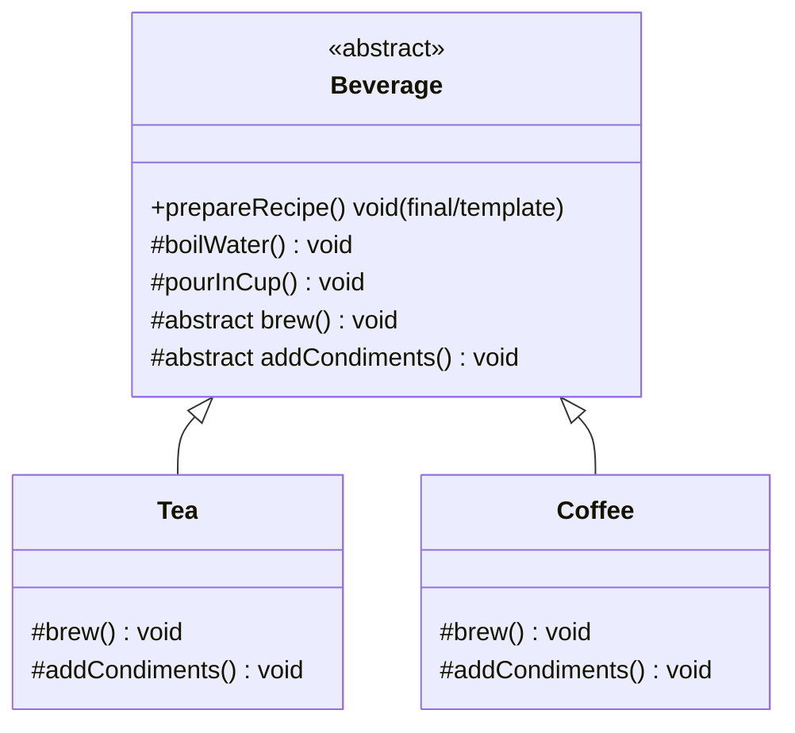

# Template Method Design Pattern (Behavioral Pattern)

> **"Defines the skeleton of an algorithm in a method, deferring some steps to subclasses. Template Method lets subclasses redefine certain steps of an algorithm without changing the algorithm's structure."**

---

## Simple Version (Aasan Bhasha Mein)
Template Method ka matlab hai **ek standard workflow (process) ka dhancha (skeleton) define karna**. 

Kuch steps saare implementations ke liye same hote hain, aur kuch steps har implementation ke liye alag hote hain. Hum common steps ko base class mein likhte hain, aur dynamic/custom steps ko subclasses par chhod dete hain (abstract methods ke roop mein).

---

## The Analogy: Chai vs Coffee ☕
Dono ko banane ka process lagbhag same hai:
1. **Boil Water** (Common for both)
2. **Brew** (Tea leaves for Chai, Coffee beans for Coffee - *Different*)
3. **Pour in Cup** (Common for both)
4. **Add Condiments** (Milk/Sugar for Chai, Sugar/Ice for Coffee - *Different*)

Hum ek base class `Beverage` banate hain jo final method `prepareRecipe()` define karegi. Ye method workflow ka order decide karega, par individual steps subclasses define karengi.

---

## Why use Template Method?
1. **Code Reusability:** Duplicate code nahi likhna padta. Common steps (like boiling water, pouring in cup) ko base class mein ek hi baar likhte hain.
2. **Controlled Extension:** Subclasses sirf specific steps ko override kar sakti hain, wo algorithm ke structure (order of steps) ko change nahi kar sakti.

---

## Class Diagram

---

## File to Implement
File Name: `beverage_template.ts`

### Task Description:
Hum ek automated beverage maker simulate karenge.

1. **Abstract Base Class `Beverage`:**
   - Method `prepareRecipe(): void` (Ye humara **Template Method** hai. Iske andar steps calls ka sequence fixed hoga: `boilWater() -> brew() -> pourInCup() -> addCondiments()`).
   - Method `boilWater(): void` (Log: `"Water is boiling..."`)
   - Method `pourInCup(): void` (Log: `"Pouring into cup..."`)
   - Abstract method `brew(): void`
   - Abstract method `addCondiments(): void`
2. **Subclasses:**
   - **`Tea`**:
     *   `brew()`: Log `"Steeping the tea bag..."`
     *   `addCondiments()`: Log `"Adding lemon..."`
   - **`Coffee`**:
     *   `brew()`: Log `"Dripping coffee through filter..."`
     *   `addCondiments()`: Log `"Adding sugar and milk..."`
3. **Client Code:**
   - Create `Tea` object and call `prepareRecipe()`.
   - Create `Coffee` object and call `prepareRecipe()`.
   - Check the terminal logs to see the execution sequence.
