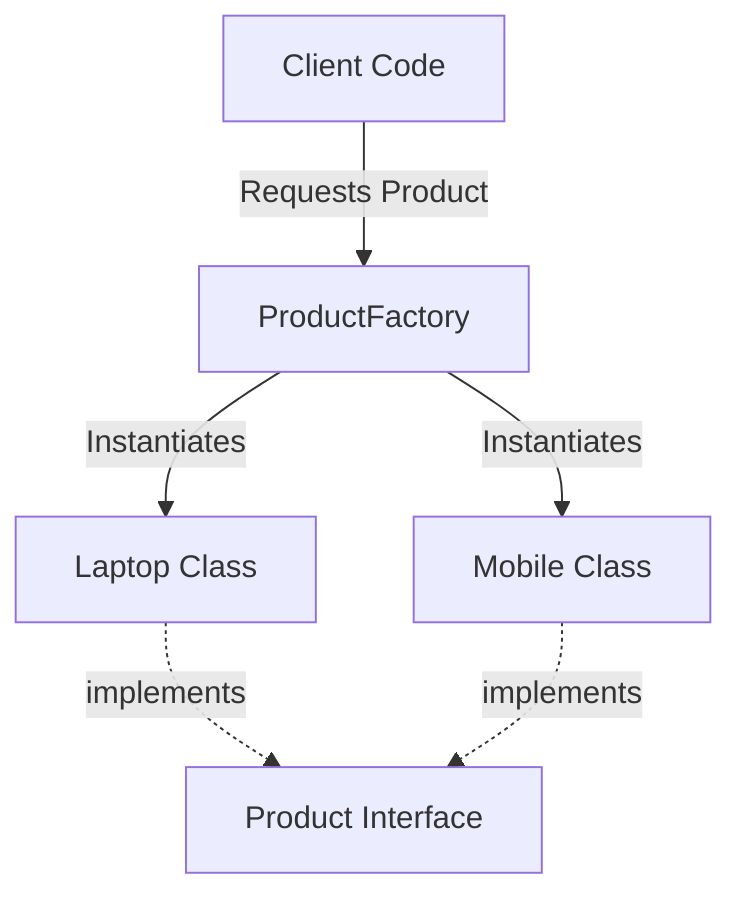

# Factory Design Pattern (Creational Pattern)

> **"Define an interface for creating an object, but let subclasses decide which class to instantiate."**

---

## Simple Version (Aasan Bhasha Mein)
Factory pattern ka matlab hai ki **object banane ka saara logic ek separate class (Factory) ke andar daal dena**, taaki client code ko direct `new` keyword se objects na banana pade. Client bas Factory se bolega: "Mujhe X type ka object do", aur Factory use bana kar de degi.

---

## The Analogy: Toy Factory 🏭
Soch tu ek khilone ki dukaan par jata hai. Tu bolta hai: "Mujhe ek **Car Toy** do" ya "Mujhe ek **Robot Toy** do". 
Dukaan ke andar piche ek **Factory** hai jo requirements ke hisab se khilona banakar tere hath mein de deti hai. Tujhe ye janne ki zaroorat nahi hai ki plastic kaise melt hua ya paint kaise hua (Object creation details are hidden from you).

---

## Why do we need it? (The Problem it solves)
Agar hamari application mein multiple places par we do:
`const logger = new FileLogger("/var/log/app.log", 1024, true);`
Kal ko agar constructor change hota hai or we want to switch to `DbLogger`, toh hume **poori application mein har jagah** changes karne padenge. 
**Solution:** `const logger = LoggerFactory.createLogger("file");` (Sirf factory class change karni padegi, client safe rahega).

---

## Structure: How to implement Factory in TypeScript?

1. **Product Interface:** Ek common rulebook jo batati hai ki banne wale objects ke paas kya functions honge.
2. **Concrete Products:** Classes jo us interface ko actual implement karti hain (e.g., Laptop, Mobile).
3. **Factory Class:** Ek class jisme static method `createProduct(type: string)` hoga jo decision lekar object return karega.

---

## File to Implement
File Name: `vehicle_factory.ts`

### Task Description:
1. Ek interface banao **`Vehicle`** jisme method ho: `drive(): void`.
2. Do classes banao jo `Vehicle` implement karein:
   - **`Car`** (drive prints: "Driving a luxury car!")
   - **`Bike`** (drive prints: "Riding a sporty bike!")
3. Ek class banao **`VehicleFactory`** jiske paas static method ho:
   - `createVehicle(type: string): Vehicle`
   - Agar type `"car"` ho, toh returns `new Car()`.
   - Agar type `"bike"` ho, toh returns `new Bike()`.
   - Baaki cases ke liye throw error: `"Vehicle type not supported"`.
4. Client code mein factory ke through objects mangwao aur `drive()` run karo.
