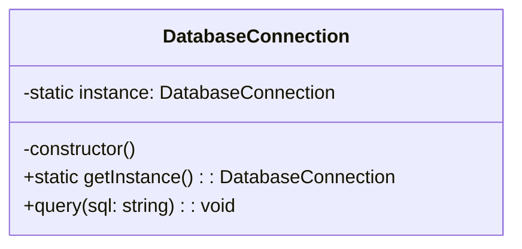

# Singleton Design Pattern (Creational Pattern)

> **"Ensure a class has only one instance, and provide a global point of access to it."**

---

## Simple Version (Aasan Bhasha Mein)
Singleton pattern ka matlab hai ki puri application ke lifetime mein ek class ka **sirf aur sirf ek hi object (instance)** banna chahiye. Agar koi doosri class naya object banane ki koshish kare, toh use wahi purana/existing object wapas mil jaye.

---

## The Analogy: President of a Country 🇮🇳
Ek desh mein ek waqt par sirf ek hi President (Rashtrapati) ho sakta hai. Jab bhi kisi ko President se baat karni hoti hai, wo usi single unique person (instance) ke paas jata hai. Naya President apni marzi se create nahi kiya ja sakta.

---

## Why do we need it? (Real-world Software Example)
1. **Database Connection Pool:** Agar tumhaari app mein har database query ke liye `new DBConnection()` banega, toh memory exhaust ho jayegi aur app crash ho jayegi. Hume poori app ke liye ek hi shared Connection Object chahiye.
2. **Logger Service:** App ke har corner se aane wale logs ek hi unique log file/buffer mein jane chahiye.

---

## How to implement Singleton in TypeScript/Java?

Singleton banane ke 3 sunahre niyam (rules):
1. **Private Constructor:** Constructor ko `private` kar do, taaki bahar se koi `new MyClass()` na kar sake (Compile error dega).
2. **Private Static Instance Variable:** Apne hi class ke type ka ek private variable hold karo jo unique instance ko store karega.
3. **Public Static Method (`getInstance()`):** Ek function banao jo check karega: "Kya pehle se instance bana hua hai? Agar nahi, toh naya banao, aur agar bana hua hai, toh wahi purana return kar do."



---

## File to Implement
File Name: `db_singleton.ts`

### Task Description:
1. Ek class banao **`DatabaseConnection`**.
2. Uska constructor `private` rakho aur console.log karo: `"Database Connection Established!"`.
3. Uske andar static method banao `getInstance()`.
4. Ek query method banao: `query(sql: string)` jo print kare running query.
5. Client code mein test karo:
   ```typescript
   const conn1 = DatabaseConnection.getInstance();
   const conn2 = DatabaseConnection.getInstance();

   console.log(conn1 === conn2); // True aana chahiye! (Matlab dono same hi instance hain)
   ```
