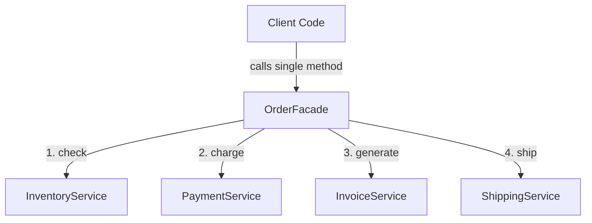

# Facade Design Pattern (Structural Pattern)

> **"Provide a unified interface to a set of interfaces in a subsystem. Facade defines a higher-level interface that makes the subsystem easier to use."**

---

## Simple Version (Aasan Bhasha Mein)
Facade pattern ka matlab hai ek **complex system ke aage ek simple parda (interface) laga dena**. 

Agar kisi kaam ko karne ke liye 4-5 alag-alag classes/libraries se baat karni pad rahi hai, toh client ko un sabse direct connect karne ke bajay, hum ek **Facade class** banate hain jo saare complex calls ko ek single function ke peeche chhipa deti hai.

---

## The Analogy: Ordering Food in a Restaurant 🍽️
Soch tu ek restaurant mein gaya. Tu direct kitchen mein jaakar chef se baat nahi karta, bartan dhone wale se baat nahi karta, ya billing counter par bar-bar nahi jata.
*   Tu sirf **Waiter (Facade)** se baat karta hai.
*   Tu bolta hai: "Waiter, 1 Pizza la do."
*   Waiter internally chef, helper, aur billing system se communicate karta hai aur tujhe food lake de deta hai.
*   Waiter restaurant ke complex subsystem ka **Facade** hai.

---

## The Problem: Tight Coupling ❌
Maan lo humari e-commerce app mein user order place karta hai. Client code ko ye saare steps manually karne padte hain:
```typescript
inventory.checkStock(itemId);
payment.processPayment(userId, amount);
invoice.generate(userId, itemId);
shipping.arrangeDelivery(itemId);
```
**Dikkat:** Client code bohot complex ho gaya hai. Agar kal ko `Shipping` ya `Payment` ka constructor ya method change hua, toh har wo file toot jayegi jahan order place ho raha hai.

---

## The Solution: The Facade Class 
Hum ek `OrderFacade` class banate hain jiske paas sirf ek method hota hai: `placeOrder()`.

```typescript
class OrderFacade {
    placeOrder(itemId, userId) {
        // Internally runs:
        // checkStock -> processPayment -> generateInvoice -> arrangeDelivery
    }
}
```
Client code ab sirf ek line likhega: `orderFacade.placeOrder(101, 202)`.



---

## File to Implement
File Name: `order_facade.ts`

### Task Description:
Hum ek E-commerce Order Processing subsystem banayenge.

1. **Subsystem Classes:**
   - **`Inventory`**: Method `checkStock(itemId: number): boolean` (returns true, logs: "Checking stock for item [id]")
   - **`Payment`**: Method `chargeCard(amount: number): boolean` (returns true, logs: "Charging card with amount [amount]")
   - **`Shipping`**: Method `shipProduct(itemId: number): void` (logs: "Product [id] has been shipped")
2. **Facade Class (`OrderProcessingFacade`):**
   - Holds references of `Inventory`, `Payment`, and `Shipping`.
   - Method: **`placeOrder(itemId: number, price: number): void`**
     - Stock check kare.
     - Card charge kare.
     - Product ship kare.
     - Agar koi step fail ho jaye (e.g. out of stock), toh process stop kare.
3. **Client Code:**
   - Facade object instantiate kare aur single method call se order complete kare: `facade.placeOrder(404, 1500)`.
